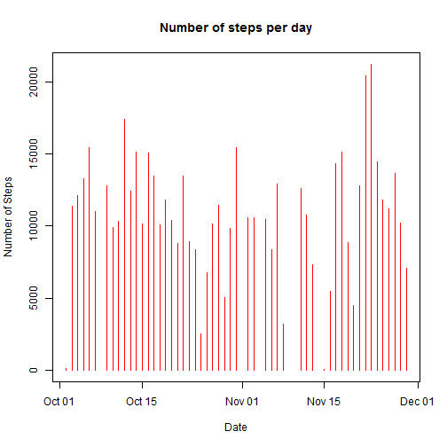
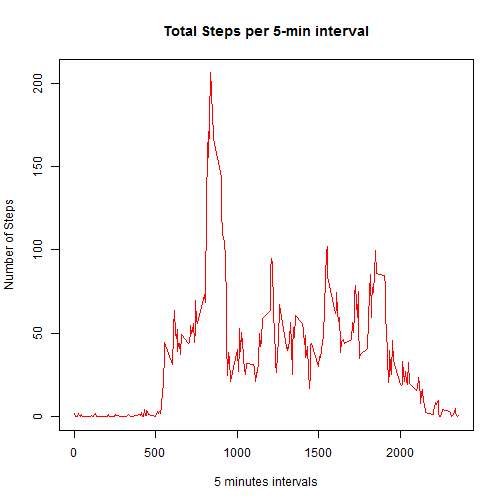
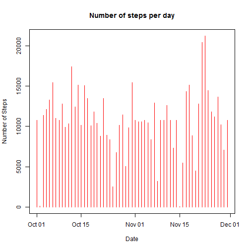
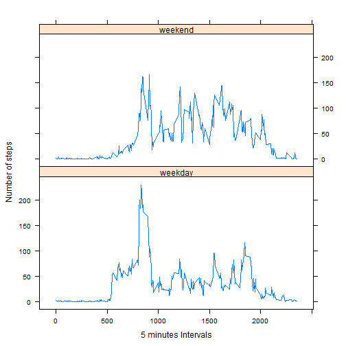

This is an R Markdown document. Markdown is a simple formatting syntax for authoring HTML, PDF, and MS Word documents. For more details on using R Markdown see <http://rmarkdown.rstudio.com>.

Loading and preprocessing the required data:


```r
# libraries
library(lattice)

# Setting seed for reproducibility
set.seed(100000)

# Reading the subject files
unzip("activity.zip")
CompleteData <- read.csv("activity.csv")
str(CompleteData)
```

```
## 'data.frame':	17568 obs. of  3 variables:
##  $ steps   : int  NA NA NA NA NA NA NA NA NA NA ...
##  $ date    : Factor w/ 61 levels "2012-10-01","2012-10-02",..: 1 1 1 1 1 1 1 1 1 1 ...
##  $ interval: int  0 5 10 15 20 25 30 35 40 45 ...
```

```r
summary(CompleteData)
```

```
##      steps                date          interval     
##  Min.   :  0.00   2012-10-01:  288   Min.   :   0.0  
##  1st Qu.:  0.00   2012-10-02:  288   1st Qu.: 588.8  
##  Median :  0.00   2012-10-03:  288   Median :1177.5  
##  Mean   : 37.38   2012-10-04:  288   Mean   :1177.5  
##  3rd Qu.: 12.00   2012-10-05:  288   3rd Qu.:1766.2  
##  Max.   :806.00   2012-10-06:  288   Max.   :2355.0  
##  NA's   :2304     (Other)   :15840
```

```r
# pre processing the date
CompleteData$date <- as.Date(CompleteData$date, "%Y-%m-%d")

# Removing the null values
CompleteData<-na.omit(CompleteData)
summary(CompleteData)
```

```
##      steps             date               interval     
##  Min.   :  0.00   Min.   :2012-10-02   Min.   :   0.0  
##  1st Qu.:  0.00   1st Qu.:2012-10-16   1st Qu.: 588.8  
##  Median :  0.00   Median :2012-10-29   Median :1177.5  
##  Mean   : 37.38   Mean   :2012-10-30   Mean   :1177.5  
##  3rd Qu.: 12.00   3rd Qu.:2012-11-16   3rd Qu.:1766.2  
##  Max.   :806.00   Max.   :2012-11-29   Max.   :2355.0
```

Ignoring the missing values in the dataset, we will find out the mean and median total number of steps taken per day with a plot:


```r
TotalStepsPerDay <- aggregate(steps ~ date, data = CompleteData, sum, na.rm = TRUE)
with(TotalStepsPerDay, plot(date, steps, type = "h", col = "red", main = "Number of steps per day", xlab = "Date", ylab = "Number of Steps")) 
```

 

```r
# Calculate and report the mean and median total number of steps taken per day
mean(TotalStepsPerDay$steps)
```

```
## [1] 10766.19
```

```r
median(TotalStepsPerDay$steps)
```

```
## [1] 10765
```

With a time series plot, we will examine the average daily activity pattern of the 5-minute interval and the average number of steps taken, averaged across all days 


```r
TotalStepsPerInt <- aggregate(steps ~ interval, data = CompleteData, mean, na.rm = TRUE)
str(TotalStepsPerInt)
```

```
## 'data.frame':	288 obs. of  2 variables:
##  $ interval: int  0 5 10 15 20 25 30 35 40 45 ...
##  $ steps   : num  1.717 0.3396 0.1321 0.1509 0.0755 ...
```

```r
with(TotalStepsPerInt, plot(interval, steps, type = "l", col = "red", main = "Total Steps per 5-min interval", xlab = "5 minutes intervals", ylab = "Number of Steps"))
```

 

```r
TotalStepsPerInt$interval[which.max(TotalStepsPerInt$steps)] # Which 5-minute interval, on average across all the days in the dataset, contains the maximum number of steps?
```

```
## [1] 835
```

There are a number of days/intervals where there are missing values (coded as NA). The presence of missing days may introduce bias into some calculations or summaries of the data. This sections seeks to analyse the missing data further.


```r
CompleteData <- read.csv("activity.csv") 
sum(is.na(CompleteData)) # Calculate and report the total number of missing values in the dataset (i.e. the total number of rows with NAs)
```

```
## [1] 2304
```

```r
# Create a new dataset that is equal to the original dataset but with the missing data filled in.
CompleteData <- merge(CompleteData, TotalStepsPerInt, by = "interval", suffixes = c("", "AA"))
nullvalues <- is.na(CompleteData$steps)
CompleteData$steps[nullvalues] <- CompleteData$stepsAA[nullvalues]
CompleteData <- CompleteData[, c(1:3)]
sum(is.na(CompleteData)) # verified
```

```
## [1] 0
```

```r
str(CompleteData)
```

```
## 'data.frame':	17568 obs. of  3 variables:
##  $ interval: int  0 0 0 0 0 0 0 0 0 0 ...
##  $ steps   : num  1.72 0 0 0 0 ...
##  $ date    : Factor w/ 61 levels "2012-10-01","2012-10-02",..: 1 54 28 37 55 46 20 47 38 56 ...
```

```r
# Make a histogram of the total number of steps taken each day and Calculate and report the mean and median total number of steps taken per day. Do these values differ from the estimates from the first part of the assignment? What is the impact of imputing missing data on the estimates of the total daily number of steps?
CompleteData$date <- as.Date(CompleteData$date, "%Y-%m-%d")
TotalStepsPerDay <- aggregate(steps ~ date, data = CompleteData, sum, na.rm = TRUE)
with(TotalStepsPerDay, plot(date, steps, type = "h", col = "red", main = "Number of steps per day", xlab = "Date", ylab = "Number of Steps")) 
```

 

```r
mean(TotalStepsPerDay$steps)
```

```
## [1] 10766.19
```

```r
median(TotalStepsPerDay$steps)
```

```
## [1] 10766.19
```

```r
# Impact - the mean and median is now the same as compared to before where there was a slight variance.
```

Are there differences in activity patterns between weekdays and weekends?

Create a new factor variable in the dataset with two levels - "weekday" and "weekend" indicating whether a given date is a weekday or weekend day.

We will make a panel plot containing a time series plot of the 5-minute interval  and the average number of steps taken, averaged across all weekday days or weekend days.


```r
CompleteData$day <- "weekday"
CompleteData$day[weekdays(as.Date(CompleteData$date), abb=T) %in% c("Sat","Sun")]  <- "weekend" 

TotalStepsPerInt <- aggregate(steps ~ interval + day, data = CompleteData, mean, na.rm = TRUE)
xyplot(steps ~ interval | day, TotalStepsPerInt, type = "l", layout = c(1, 2), xlab = "5 minutes Intervals", ylab = "Number of steps")
```

 
